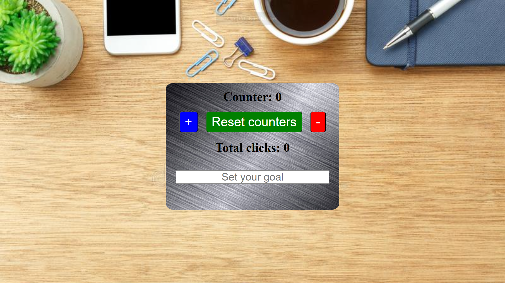

# 👆 SimpleCounter

Questo progetto è un semplice contatore di clic creato con JavaScript. L'utente può incrementare, decrementare il contatore e impostare un obiettivo di conteggio. Quando il contatore raggiunge l'obiettivo impostato, viene visualizzato un messaggio di congratulazioni. Il design dell'applicazione è responsive, quindi funziona su qualsiasi dispositivo, inclusi smartphone, tablet e desktop.

## 🎯 Funzionalità

Le funzionalità principali dell'applicazione includono:

1. Incrementa il contatore
2. Decrementa il contatore
3. Mostra il numero totale di clic effettuati
4. Mostra un messaggio di congratulazioni quando il contatore raggiunge l'obiettivo
5. Resetta il contatore e il conteggio dei clic
6. Design responsive che si adatta a qualsiasi dimensione dello schermo

## 📱 Demo

Puoi provare l'applicazione qui: [Link all'applicazione](https://Frankxyz13.pythonanywhere.com)

## 🖼️ Screenshot



## 💻 Codice di esempio

Ecco come il contatore viene incrementato, decrementato e resettato:

```javascript
// Funzione per incrementare il valore del contatore
function increment() {
    counter ++;
    counterDisplay.innerHTML = `Counter: ${counter}`;
    clicks_counter();
}

// Funzione per decrementare il valore del contatore
function decrement() {
    counter --;
    counterDisplay.innerHTML = `Counter: ${counter}`;
    clicks_counter();
}

// Funzione per resettare il valore del contatore e del contatore dei clic
function reset_counter() {
    counter = 0;
    clicks = 0;
    counterDisplay.innerHTML = `Counter: ${counter}`;
    totalClicks.innerHTML = `Total clicks: ${clicks}`;
    congratulation.innerHTML = "Congratulations! Goal reached!";
    congratulation.style.visibility = "hidden";
    setGoalInput.value = "";
}
```
## 🎉 Conclusioni

Questo progetto è stato realizzato come prova delle competenze in JavaScript per Star2Impact.

